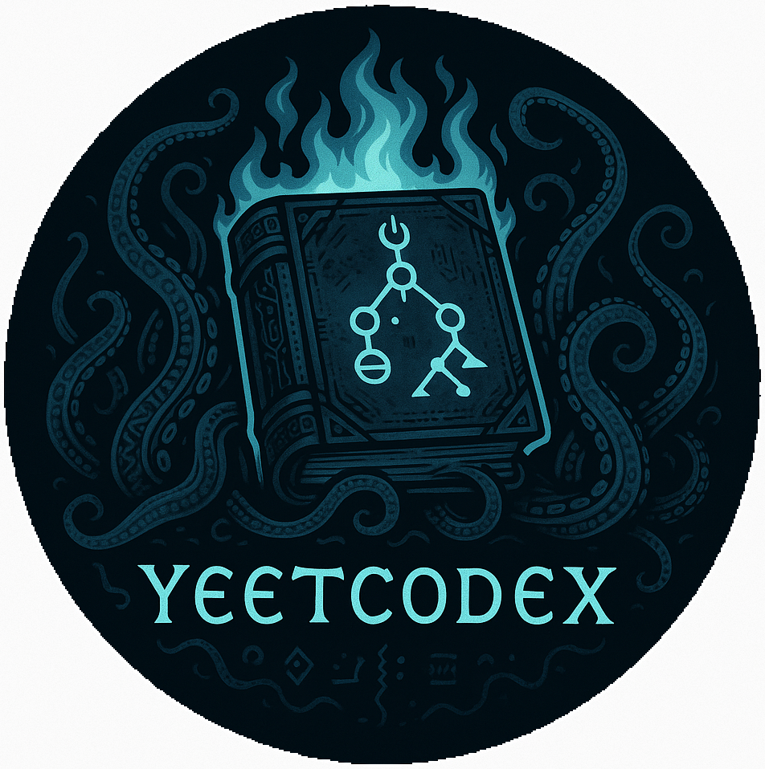

<h1 align="center">
  <br>
  <div style="width:312px; height:312px; border-radius:50%; overflow:hidden; border:4px solid #333; margin: 0 auto; display:flex; align-items:center; justify-content:center;">
    
  </div>
  The Yeetcodex
  <br>
</h1> 

<h4 align="center">A curated compendium of resources, articles, and guides for mastering Data Structures, Algorithms, and LeetCode problem-solving.</h4>

<p align="center">
  <a href="#"></a>
  <a href="#"></a>
  <a href="#"></a>
</p>

<p align="center">
  <a href="#key-features">Key Features</a> •
  <a href="#how-to-use">How To Use</a> •
  <a href="#resources">Resources</a> •
  <a href="#credits">Credits</a> •
  <a href="#license">License</a>
</p>

## Key Features

* Curated learning paths and references for mastering DSA & problem solving
* Great reads, guides, and roadmaps for sharpening your approach
* Collections of categorized problems and topic-specific patterns
* Designed for clarity, pragmatism, and long-term learning

## How To Use

To clone and explore this compendium:

```bash
# Clone this repository
git clone https://github.com/brunohaf/yeetcodex.git

# Go into the repository
cd yeetcodex
````

> **Note**
> This repo includes a submodule for my personal solutions. To initialize submodules, run:

```bash
git submodule update --init --recursive solutions
```

## Resources

### 🧠 Algorithms and Problem Solving

* 🔥 [A Road Map for Mastering Coding Challenges](https://whimsical.com/codeforces-candidate-master-roadmap-by-love-babbar-CiXPPD3CnwoXPr2d8Ajx1h)
* 🔥 [GeeksForGeeks' Guide for Competitive Programming](https://www.geeksforgeeks.org/competitive-programming-a-complete-guide/?ref=outind)
* 🔥 [How to Effectively Practice CP + Problem Solving Guide](https://codeforces.com/blog/entry/116371)
* 🔥 [Competitive Programming (pt-br)](https://github.com/UnBalloon/programacao-competitiva)
* 🔥 [The Algorithms](https://github.com/TheAlgorithms)
* 🔥 [Visualising data structures and algorithms through animation](https://visualgo.net/en)
* 🔥 [Public Google Drive with DSA Books](https://drive.google.com/drive/folders/1rVwGTcLf67jB9iTDgqXF1EoBHnkJH7Lx)
* [Simple Guide to Competitive Programming](https://codeforces.com/blog/entry/103141)
* [Leetcode Patterns (Medium)](https://medium.com/leetcode-patterns)
* [Algorithms for Competitive Programming](https://cp-algorithms.com/)
* [CodeChef](https://www.codechef.com/)
* [CSES Handbook (PDF)](https://cses.fi/book/book.pdf)


### 📌 Problem Sets

* 🔥 [Leetcode Patterns Question List](https://seanprashad.com/leetcode-patterns/)
* 🔥 [Codeforces Ladders](https://earthshakira.github.io/a2oj-clientside/server/Ladders.html)
* [CSES Problem Set](https://cses.fi/problemset/)

### 📚 Good Reads

* 🔥 [How to Create Test Cases on LeetCode](https://support.leetcode.com/hc/en-us/articles/32442719377939-How-to-create-test-cases-on-LeetCode)
* [Top Coding Patterns for FAANG Interviews](https://interviewnoodle.com/top-leetcode-patterns-for-faang-coding-interviews-bdbe8766534c)
* [14 Patterns to Ace Any Coding Interview](https://hackernoon.com/14-patterns-to-ace-any-coding-interview-question-c5bb3357f6ed)
* [Grokking LeetCode](https://interviewnoodle.com/grokking-leetcode-a-smarter-way-to-prepare-for-coding-interviews-e86d5c9fe4e1)
* [DSA Templates in Python](https://deeply-apparel-79f.notion.site/DSA-CP-Templates-in-Python-8da3386924d4417d94a1eb4b2bc58779)

### 🎥 YouTube

* [Dynamic Programming – Best Explainer](https://youtu.be/oBt53YbR9Kk?si=oV5po9mpA2o4tmaG)

---

## Solutions

Solutions are maintained separately in the submodule:

* The Shinning [Tapezohedron(logn)](https://github.com/brunohaf/tapezohedronlogn) – Lovecraftian-themed leetcode solution vault (submodule).


---

## Credits

Thanks to the open-source and competitive programming communities for the countless guides, ladders, and problem sets that make this ecosystem thrive.

## License

[Apache 2.0](LICENSE)

---
> GitHub [@brunohaf](https://github.com/brunohaf)
